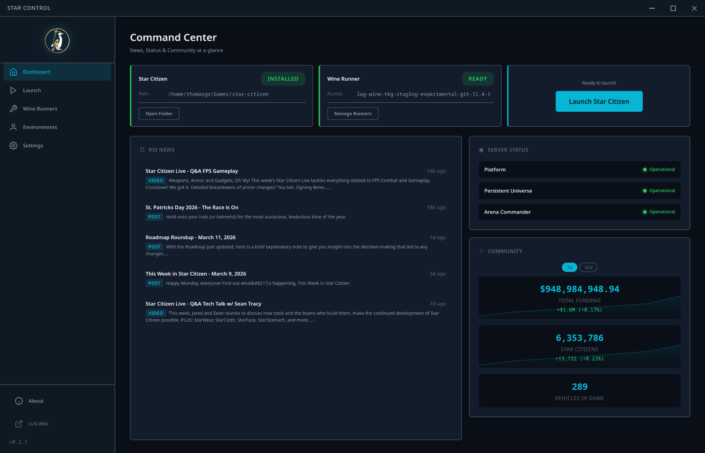
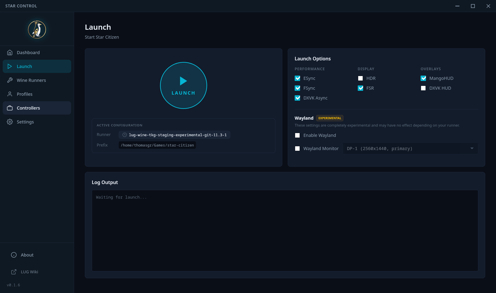
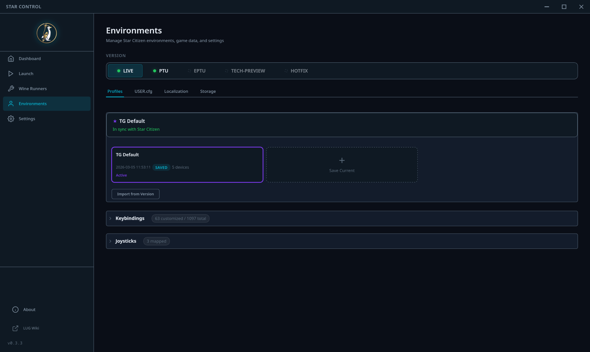
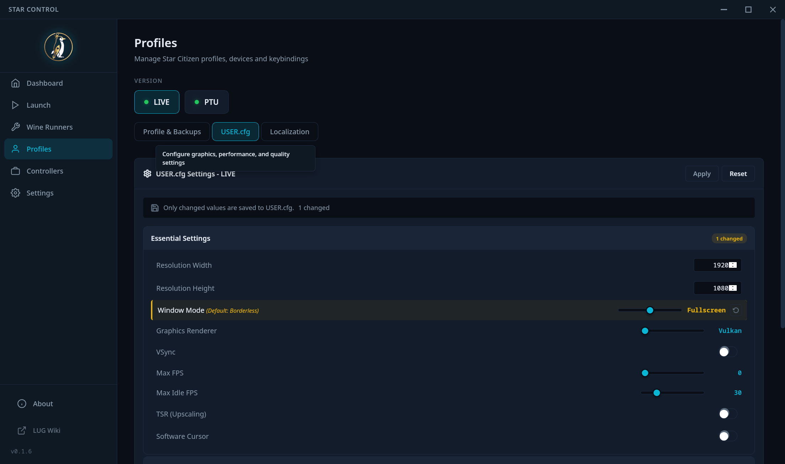
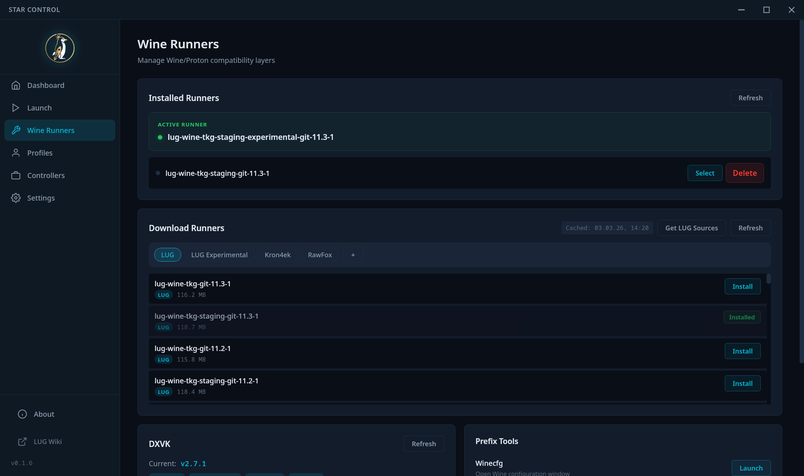
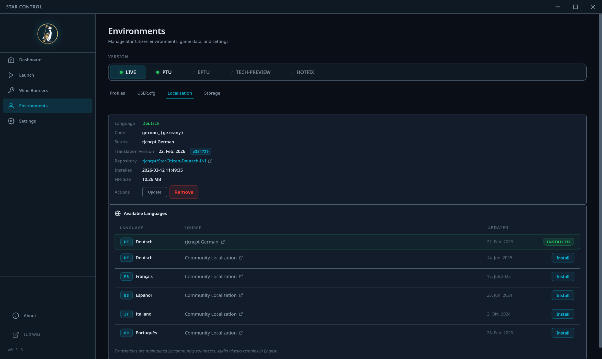
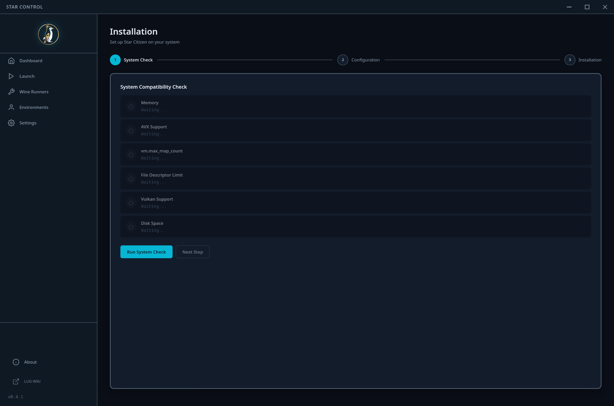
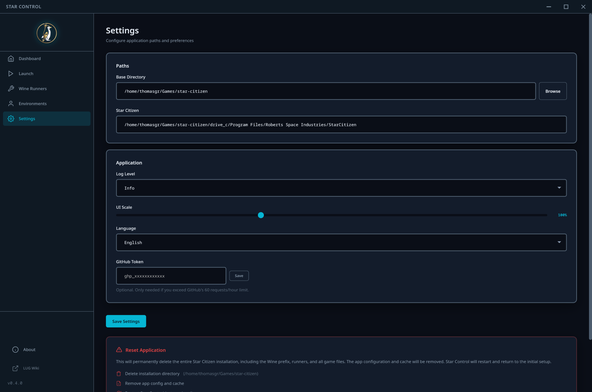
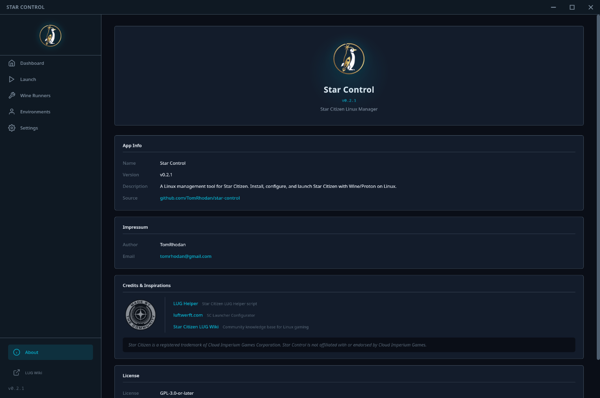

<p align="center">
  
</p>

<h1 align="center">Star Control</h1>

<p align="center">
  A Linux management tool for Star Citizen.<br>
  Install, configure, and launch Star Citizen with Wine/Proton - no terminal required.
</p>

<p align="center">
  Built with <a href="https://tauri.app/">Tauri 2</a> and vanilla JavaScript.
  <br>
  <strong>Version 0.3.5</strong>
</p>

---

## Screenshots

<p align="center">
  <br>
  <em>Command Center - RSI news, server status, and community stats at a glance</em>
</p>

<details>
<summary>More screenshots</summary>

<br>

<p align="center">
  <br>
  <em>Launch - One-click start with performance options and experimental Wayland support</em>
</p>

<p align="center">
  <br>
  <em>Environments - Manage bindings, profiles, and Star Citizen versions (LIVE, PTU, etc.)</em>
</p>

<p align="center">
  <br>
  <em>USER.cfg Editor - Visual editor for graphics and performance settings</em>
</p>

<p align="center">
  <br>
  <em>Wine Runners - Download runners, manage DXVK, and access prefix tools</em>
</p>

<p align="center">
  <br>
  <em>Localization - Install community translations with one click</em>
</p>

<p align="center">
  <br>
  <em>Installation - Guided Wine prefix setup and RSI Launcher download</em>
</p>

<p align="center">
  <br>
  <em>Settings - Configure application paths, log levels, and GitHub tokens</em>
</p>

<p align="center">
  <br>
  <em>About - Version info, links, and community credits</em>
</p>

</details>

## Features

- **Command Center** - Live dashboard with RSI news, server status, and community funding stats.
- **Launch Manager** - One-click start with performance options (ESync, FSync, DXVK Async, Wayland, HDR, FSR, MangoHUD).
- **Environments Management** - Manage multiple Star Citizen channels (LIVE, PTU, EPTU) from a single interface.
- **Controller & Bindings** - View connected devices, keybindings, reorder joystick instances, and manage profiles.
- **USER.cfg Editor** - Visual editor for all Star Citizen graphics, performance, and quality settings.
- **Wine Runner Management** - Download and manage Wine/Proton runners from multiple sources (LUG, Kron4ek, RawFox, Mactan).
- **DXVK Management** - Install and update DXVK versions with automatic DLL deployment.
- **Localization** - Install community translations with one click, with automatic update detection.
- **System Check & Fix** - Automated system compatibility check with auto-fix capabilities for common Linux issues.
- **Prefix Tools** - Integrated access to Winecfg, DPI scaling, and PowerShell installation via winetricks.

## Installation

### Download from Releases

Pre-built packages are available on the [GitHub Releases](https://github.com/TomRhodan/star-control/releases) page. Download the package that matches your distribution.

#### Debian / Ubuntu / Linux Mint (.deb)

```bash
# Download the .deb file from the latest release, then install it:
sudo dpkg -i star-control_*.deb

# If there are missing dependencies, fix them with:
sudo apt install -f
```

#### AppImage (any distribution)

The AppImage is a portable executable that works on any Linux distribution without installation.

```bash
# Download the .AppImage file from the latest release, then make it executable:
chmod +x Star-Control_*.AppImage

# Run it:
./Star-Control_*.AppImage
```

## Usage

### First Run

1. Launch Star Control.
2. The setup wizard will guide you through choosing an installation directory.
3. Use the **Installation** page to run a system check and set up the RSI Launcher.

### Launching Star Citizen

- Navigate to the **Launch** page.
- Configure performance options as needed and click the launch button.

### Environments & Configuration

- Use the **Environments** page to switch between LIVE/PTU versions.
- Manage your **Bindings** and **Profiles** (backup/restore) in the respective tabs.
- Use the visual **USER.cfg Editor** to tune graphics and performance.

### Wine Runners & DXVK

- Go to **Wine Runners** to download and switch between runners.
- Manage DXVK versions and use prefix tools like Winecfg or DPI scaling.

## Documentation

The Rust backend is fully documented. You can generate and browse the API documentation locally:

```bash
cargo doc --no-deps --open
```

## Contributing

Contributions are welcome! Please read our [Contributing Guide](CONTRIBUTING.md) for details on the development setup and code style. This project follows the [Contributor Covenant Code of Conduct](CODE_OF_CONDUCT.md).

## Credits

- [LUG Helper](https://github.com/starcitizen-lug/lug-helper) - Star Citizen LUG Helper script
- [luftwerft.com](https://luftwerft.com) - SC Launcher Configurator
- [Star Citizen LUG Wiki](https://wiki.starcitizen-lug.org/) - Community knowledge base

Star Citizen is a registered trademark of Cloud Imperium Games Corporation. Star Control is not affiliated with or endorsed by Cloud Imperium Games.

## License

This project is licensed under the [GNU General Public License v3.0](LICENSE).

Copyright (C) 2024-2026 TomRhodan <tomrhodan@gmail.com>
